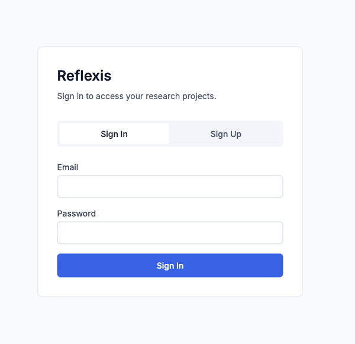
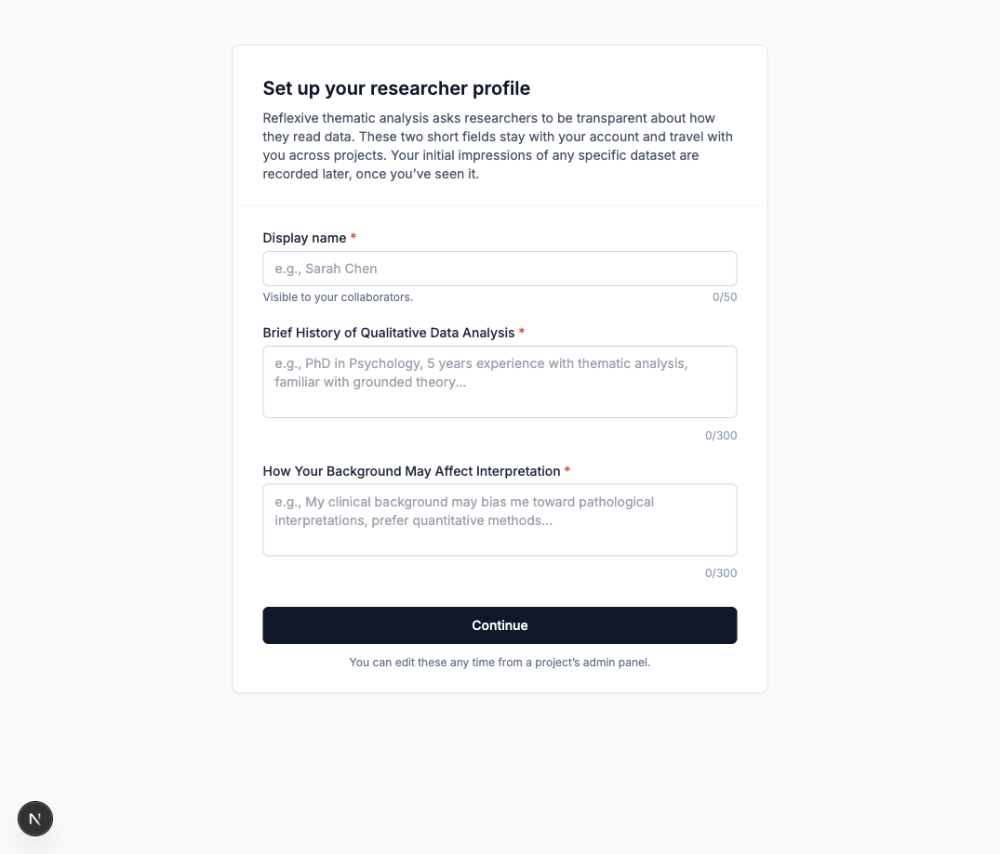
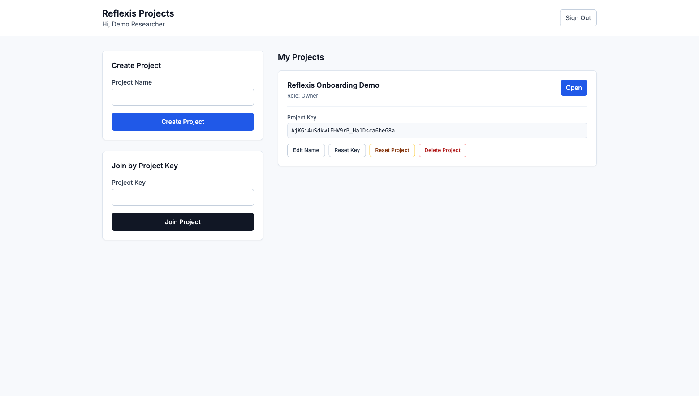
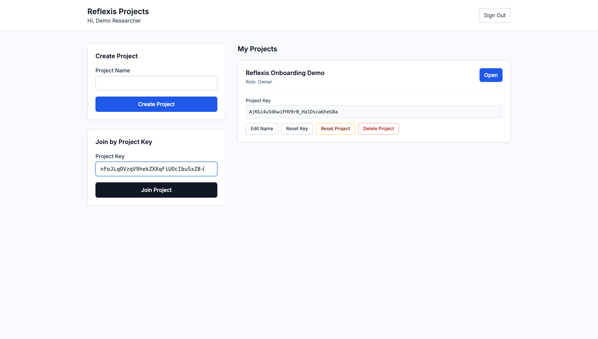
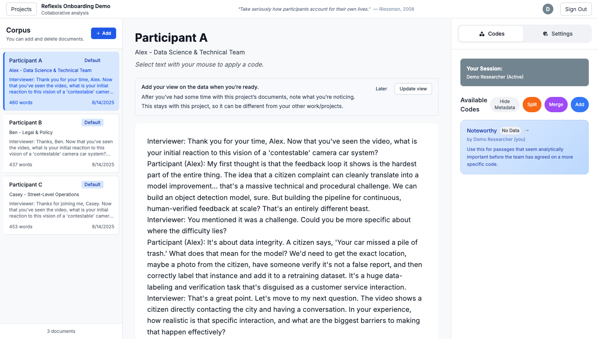
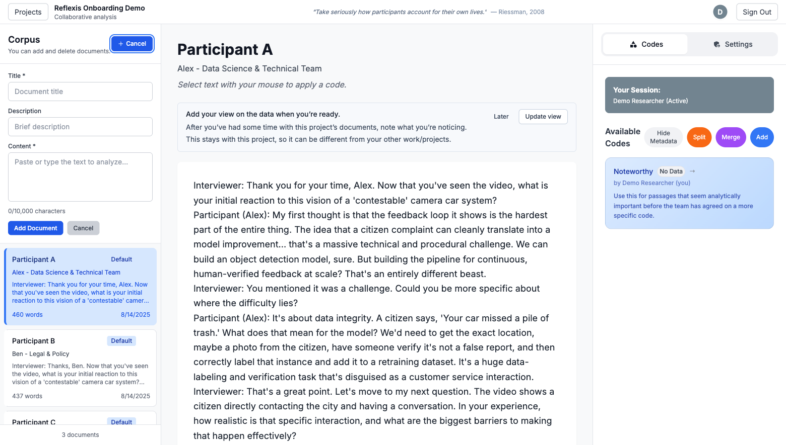
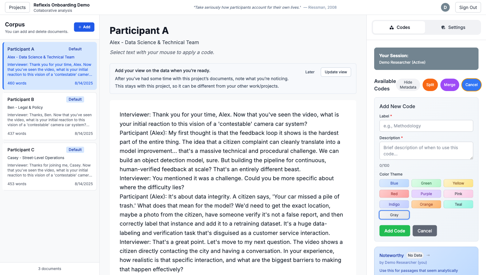
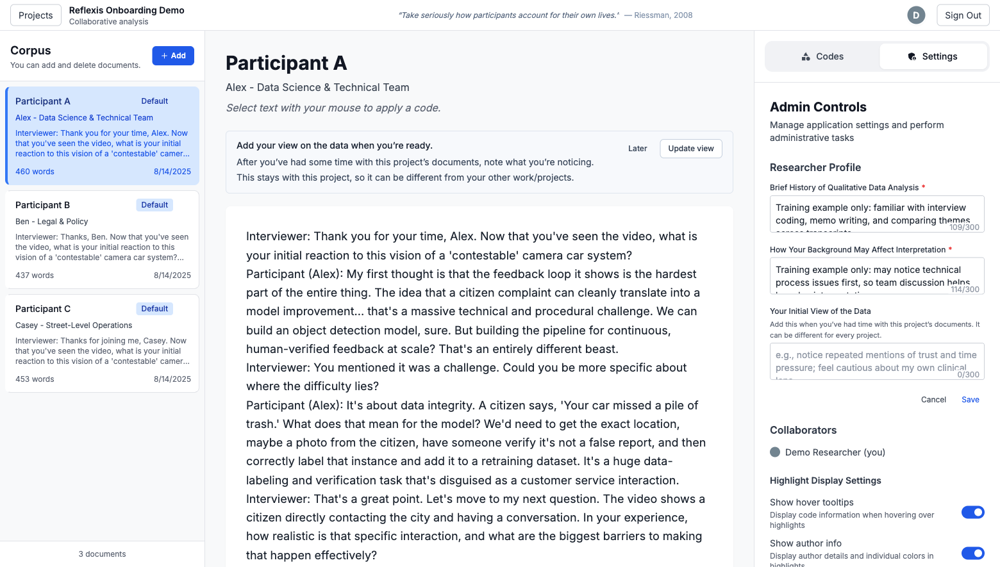

# Reflexis First-Time User Guide

Use this walkthrough to get from a fresh account to a working Reflexis project: sign up, complete your researcher profile, create or join a project, add documents, apply codes, and use the Settings controls.

## Quick Start

| Step | What to Do |
| --- | --- |
| Prepare the app | Install dependencies, copy `.env.example` to `.env.local`, and add the Firebase values. |
| Run locally | Start the app with `npm run dev`, then open the local URL shown in the terminal. |
| Use safe demo data | For demos, use a fake email, fake password, and clearly fake profile text. |
| Share or join projects | Owners share the project key. Collaborators paste it into **Join by Project Key**. |

## 1. Sign Up or Sign In

New users choose **Sign Up**, enter an email and password, then create the account. Returning users stay on **Sign In**.

- Use a real account for research work or a fake account for training.
- Password must meet the Firebase password length requirement.
- If sign-in fails, confirm email/password auth is enabled in Firebase.

## 2. Complete Your Researcher Profile

The profile captures how each researcher approaches interpretation. Collaborators can understand who is coding and what background each person brings.

- Add a display name that collaborators will recognize.
- Summarize your qualitative analysis experience.
- Note how your background may shape interpretation.

## 3. Create a Project

Project owners create a shared workspace. Reflexis creates starter documents and a default **Noteworthy** code so a team can begin immediately.

- Type a project name and click **Create Project**.
- Copy the project key from the yellow box or from the project card.
- Click **Open** to enter the analysis workspace.

## 4. Join Someone Else's Project

A collaborator uses the same dashboard but pastes a shared key into **Join by Project Key**. After joining, Reflexis opens that project.

- Ask the project owner for the project key.
- Paste the key into the **Project Key** field on the dashboard.
- To add another existing project for this walkthrough, paste this code: `nFoJLqOVzqV9hekZXXqFiUOcIbu5xZ8-`
- Click **Join Project**, then choose the project from **My Projects**.

## 5. Read Documents and Apply Codes

The workspace has three main areas: corpus on the left, active text in the middle, and analysis tools on the right.

- Select a document from **Corpus**.
- Use the on-screen reminder to add your view on the project corpus once you have read some documents.
- Drag over meaningful text in the center panel.
- Choose a code from **Available Codes** to annotate the selection.

## 6. Add Your Own Documents

Use the corpus panel to paste transcripts, field notes, survey responses, or other text. Owners can delete documents when there are no annotations attached.

- Click **Add** in the Corpus panel.
- Enter a title, optional description, and the text content.
- Click **Add Document** to place it in the shared project corpus.

## 7. Manage Codes

The right sidebar opens on **Codes**. Codes can grow with the team as patterns become clearer.

- Use **Add**, **Split**, and **Merge** to evolve the codebook.
- Click a code name to inspect the living codebook for that code.

## 8. Add Your View on the Project Corpus

After you have spent time with the project documents, add your initial view of the data. This is project-specific, so it can be different for each corpus you join.

- Use the reminder above the document text and click **Update view**.
- You can also open **Settings**, click **Edit positionality**, and fill **Your Initial View of the Data**.
- Save when you are ready. This helps collaborators understand how you first read the corpus.
- Use owner-only dashboard actions carefully: reset and delete actions remove project data.

## Troubleshooting

| Issue | Fix |
| --- | --- |
| Firebase setup screen appears | Deploy the Firestore rules in `firestore.rules`, then refresh the app. |
| AI helpers fail | Add `OPENAI_API_KEY` to the local environment for summary, prompt, and drift endpoints. |
| Project key does not work | Check that the full key was copied, including any trailing characters. |
| Owner tools look risky | **Reset Project** and **Delete Project** are destructive. Use them only for intentional cleanup. |
